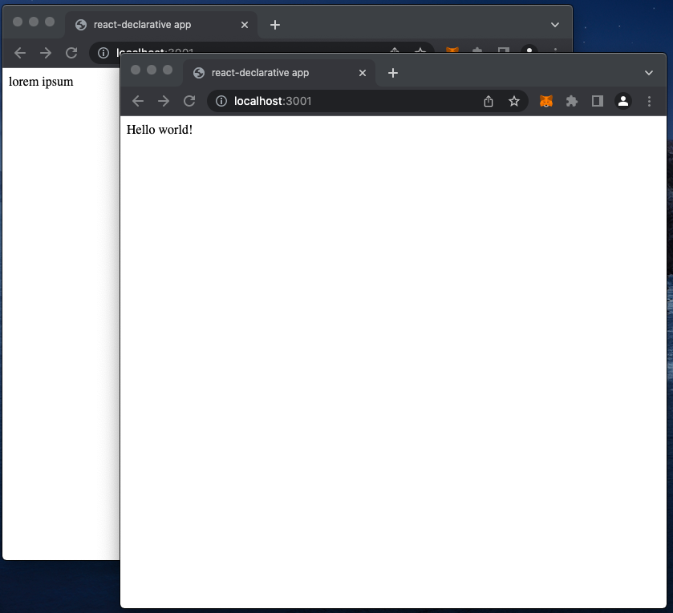

# i18n-jsx-factory

> The easiest way to setup UI translation



## How is it works

Since 17 version React provides a new version of the JSX transform

```tsx
/* Before transpile */

function App() {
  return <h1>Hello World</h1>;
}

/* After transpile */
import { jsx as _jsx } from 'react/jsx-runtime';

function App() {
  return _jsx('h1', { children: 'Hello world' });
}

```

An idea is simple. Bundler replaces `react/jsx-runtime` and `react/jsx-dev-runtime` modules with interceptor 

```js
const path = require(`path`);

module.exports = {
  webpack: {
    alias: {
      'react/jsx-runtime': path.resolve(__dirname, './src/jsx-runtime'),
      'react/jsx-dev-runtime': path.resolve(__dirname, './src/jsx-dev-runtime'),
    }
  },
};

```

The interceptior replaces `React.createElement` with `Translate.createElement` which provides localization

```js
const React = require('react');

const factory = (type, props) => {
    if (window.Translate) {
        const children = Array.isArray(props?.children) ? props?.children : [props?.children];
        return window.Translate.createElement(type, props, ...children);
    }
    return React.createElement(type, props);
};

module.exports = {
    Fragment: React.Fragment,
    jsx: factory,
    jsxs: factory,
};

```

So in a souce code we typing `lorem ipsum`

```tsx
import "./i18n";

import { createRoot } from "react-dom/client";

const wrappedApp = (
  <span>
    lorem ipsum
  </span>
);

const container = document.getElementById("root")!;

const root = createRoot(container);

root.render(wrappedApp);

```

But `Translate.createElement` transforms it into `Hello world`

```ts
import React from 'react';

import { Translate } from 'react-declarative';

const locale = {
    'lorem ipsum': 'Hello world!',
};

const translate = new Translate(locale);

window.Translate = translate;

Object.assign(React, {
    createElement: translate.createElement,
});

```
